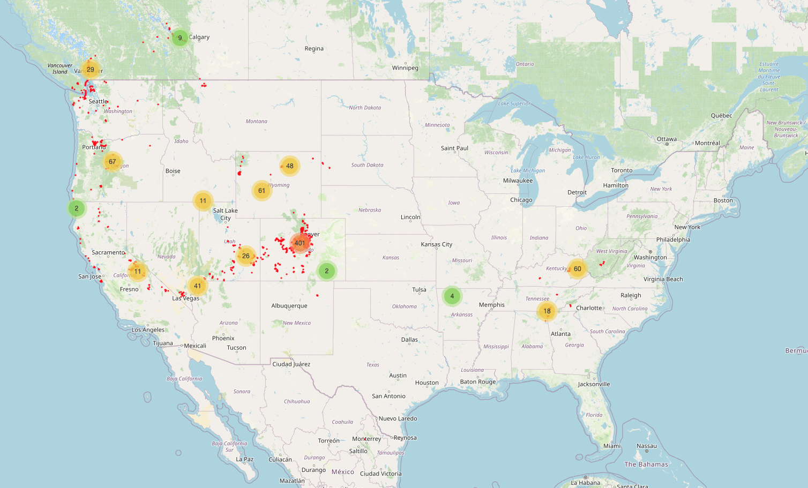

An experimental climbing prediction engine, based on Mountain Project Tick data. Currently expanding Map & Geospatial capabilities.

Requirements:
* Docker (python, jupyter...etc all run in a docker container.)
* Postgres (runs in Docker)

Setup:
* clone the repo.
* `docker-compose build`
* `docker-compose run`
* This will start 2 containers
* Jupyter server running on localhost:8887
* Postgres container running on port 5433 locally (5432 within the docker container)

Usage:
* The Jupyter notebooks are numbered in a logical order:
* `0_import_ticks_to_sql.ipynb` takes a download URL (you can replace it with your users to fetch your tick data), stores a raw csv file and also imports data into the `ticks` postgres table (it creates the table if it doesn't exist)
* `1_climbing_analysis_eda.ipynb` Does some exploratry data analysis, some custom filtering/munging based on MY mtn project data (will not be applicable to everybody), and saves a `grouped_tics.csv`, which is human readable, and a `model_ready.csv` with all columns ordinalized.
* `00_graph_grouped_ticks.ipynb` Shows a nice graph of your current ticks by grade.
* `2_climbing_random_forest.ipynb` Uses a simple Random Forest to predict attempts and lead style.
* `3_hyper_param_tuning.ipynb` does cross validation and hyper parameter tuning.

Console:
* You can open a console in the jupyter kernal to access all variables in your notebooks:
* `docker exec -it climb_wise-app-1 /bin/bash`
* from within the container: `jupyter console --existing` (or `jc` which is aliased.)
* you can access the postgres db directly with:
* `docker exec -it climb_wise-db-1`
* `psql -U postgres` (or you can change the default username/password)

Current and Future Explorations:
* Graphing data in more interactive ways. Build a front-end interface with Highcharts
* Traveling Salseman Problem w additional constraints like weather, seasonality for planning climbing/outdoor trips.)
* Recommendation engine based on ticks, star ratings, frequented areas...etc.
* Use map layers to get additional data about climbing routes/areas, such as rock type based on geology layers, and feed that into recommentation and/or prediction engines.

